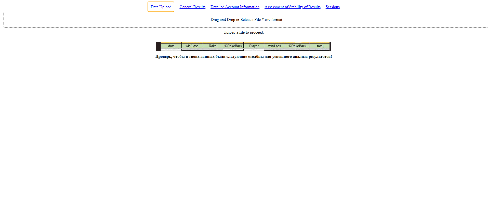
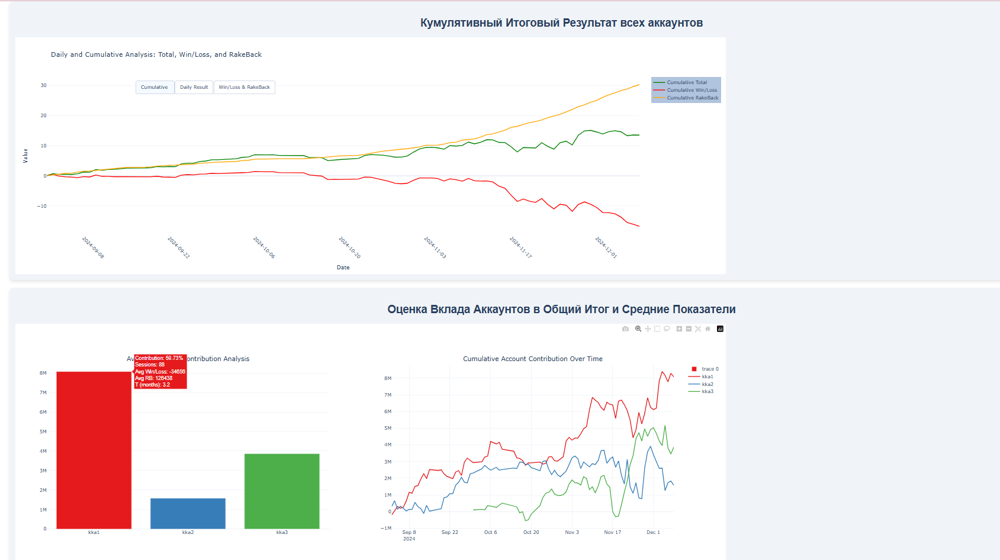
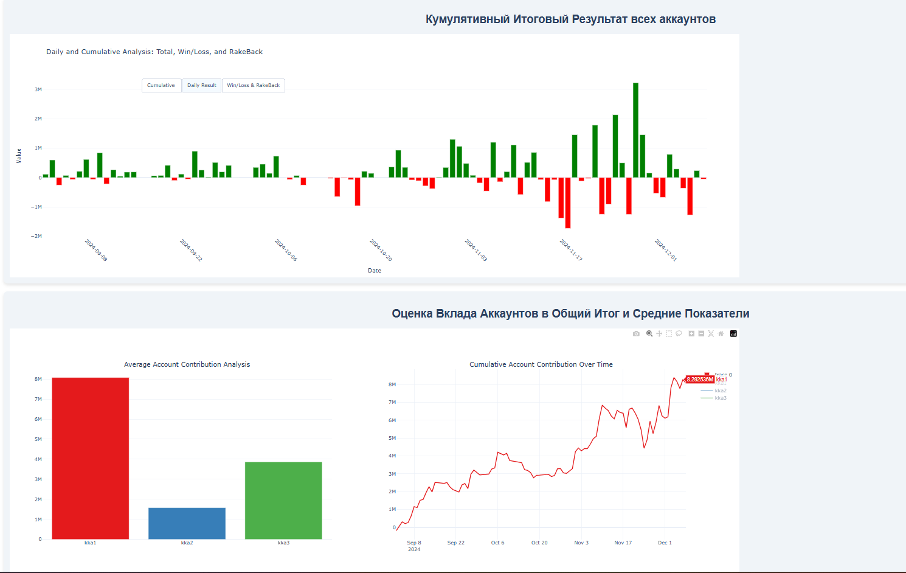
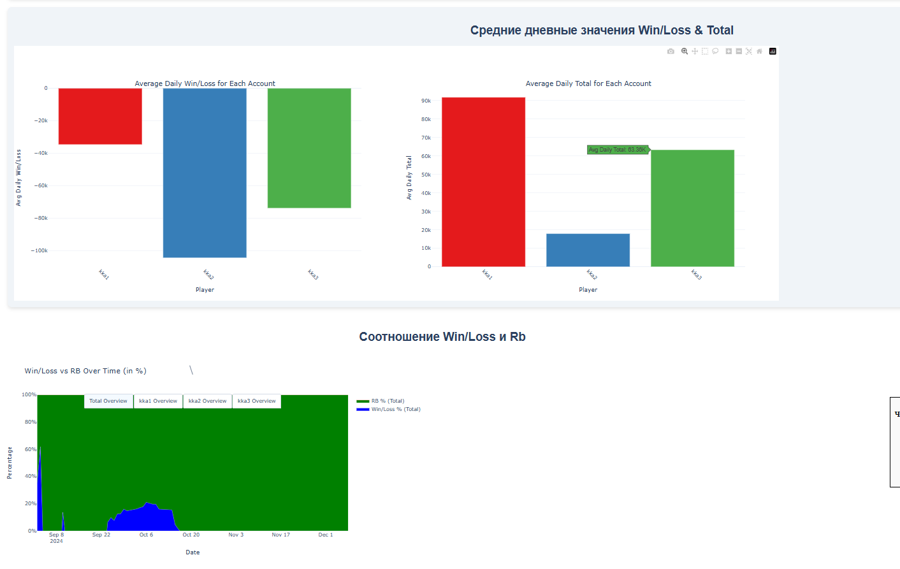
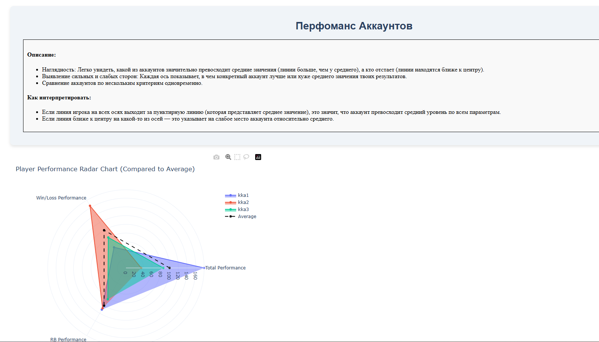
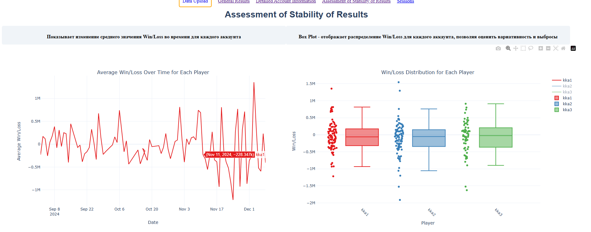
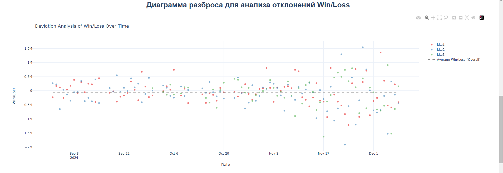

# Korea Visualization Dashboard

Интерактивная панель визуализации данных для анализа финансовых показателей, построенная с использованием Dash и Plotly.

## 🚀 Функциональность

- Загрузка и анализ данных
- Интерактивные графики и визуализации
- Анализ ежедневной активности
- Анализ производительности аккаунтов
- Анализ стабильности
- Анализ сессий
- Автоматическая отправка отчетов в Telegram

## 📊 Основные графики и анализы

1. **Ежедневный анализ**
   - Визуализация ежедневных показателей
   - Сравнение результатов по дням

2. **Анализ аккаунтов**
   - Сравнение производительности разных аккаунтов
   - Средние дневные значения
   - Анализ влияния RB

3. **Анализ стабильности**
   - Распределение изменений
   - Анализ отклонений
   - Тепловые карты активности

4. **Анализ сессий**
   - Сравнение выигрышей и проигрышей
   - Анализ максимальных и минимальных выигрышей
   - Анализ серий выигрышей и проигрышей
   - Результаты по дням недели

## 🛠 Технический стек

- Python 3.x
- Dash 2.15.0
- Plotly 5.12.0
- Pandas 1.5.3
- NumPy 1.23.5
- Python Telegram Bot 20.3

## 📥 Установка и запуск

1. Клонируйте репозиторий:
```bash
git clone [URL репозитория]
```

2. Установите зависимости:
```bash
pip install -r requirements.txt
```

3. Запустите приложение:
```bash
python main.py
```

## 📁 Структура проекта

```
├── main.py              # Основной файл приложения
├── requirements.txt     # Зависимости проекта
├── runtime.txt         # Версия Python для деплоя
├── Procfile           # Конфигурация для деплоя
├── assets/           # Статические файлы
└── temp_uploads/     # Временные файлы загрузки
```

## 🔧 Конфигурация

Для работы с Telegram-ботом необходимо настроить следующие переменные окружения:
- `TELEGRAM_BOT_TOKEN`
- `TELEGRAM_CHAT_ID`

## 📈 Примеры визуализаций

### Анализ ежедневной активности

*График показывает ежедневную активность и основные метрики производительности*

### Анализ по аккаунтам

*Сравнительный анализ производительности различных аккаунтов*

### Тепловая карта активности

*Тепловая карта показывает распределение активности по времени*

### Анализ стабильности

*График стабильности показывает отклонения от средних значений*

### Распределение результатов

*Распределение результатов по различным метрикам*

### Временной анализ

*Анализ изменений показателей во времени*

### Сравнительный анализ

*Сравнительный анализ различных метрик*

### Итоговая статистика

*Сводная статистика по всем показателям*

## 📝 Лицензия

[Укажите лицензию проекта] 